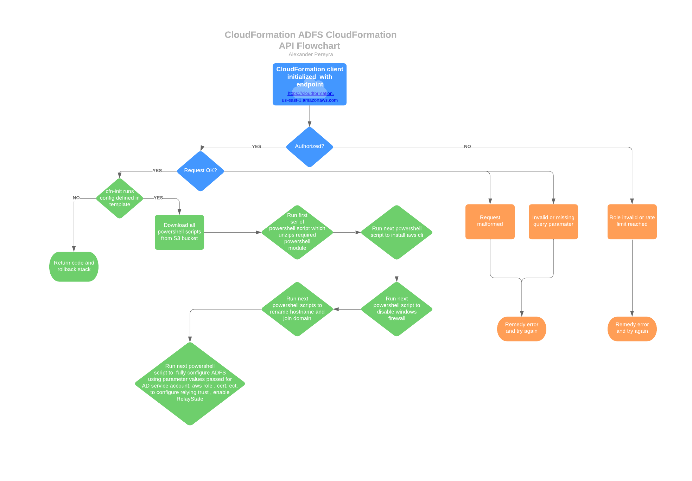

# adfs-cloudformation

Automate the build and configuration of ADFS using CloudFormation. Using the resources below as a baseline, this stack creates and configures server 2016 ADFS and joined to a domain as primary.

# resources

- Active Directory Domain Services on AWS - Quickstarts
https://aws.amazon.com/quickstart/architecture/active-directory-ds/

- Web Application Proxy on AWS - Quickstart
https://aws.amazon.com/quickstart/architecture/wap-adfs/

Enabling Identity Federation with AD FS 3.0 and Amazon AppStream 2.0
- https://aws.amazon.com/blogs/compute/enabling-identity-federation-with-ad-fs-3-0-and-amazon-appstream-2-0/
